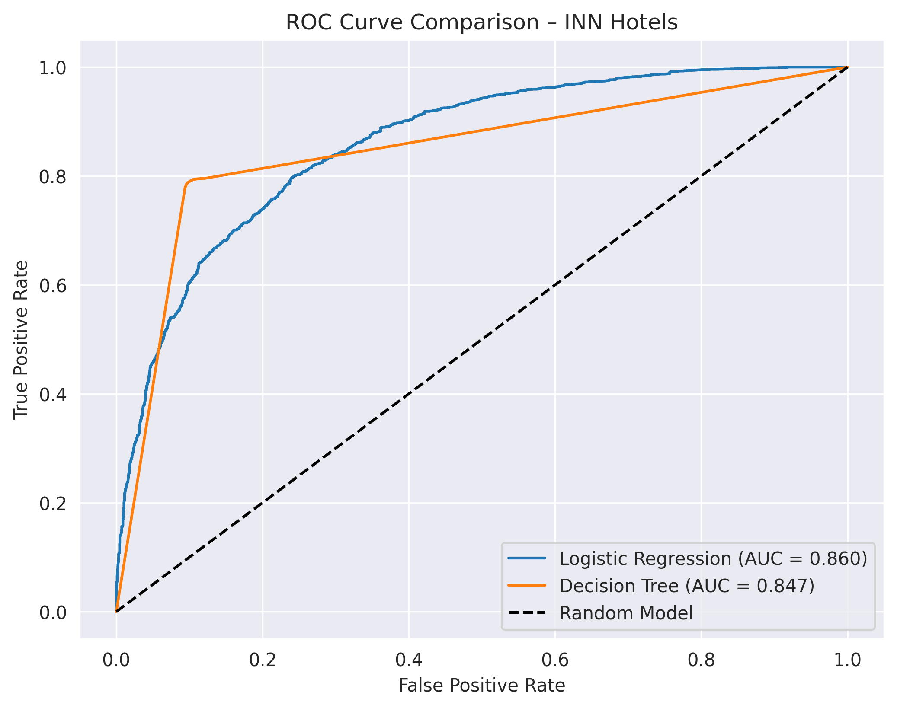
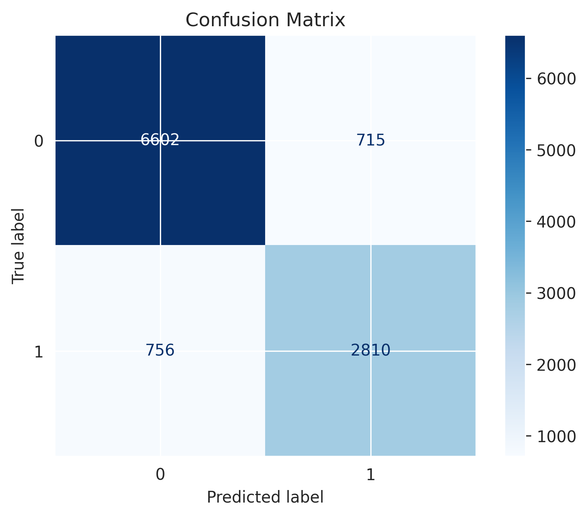
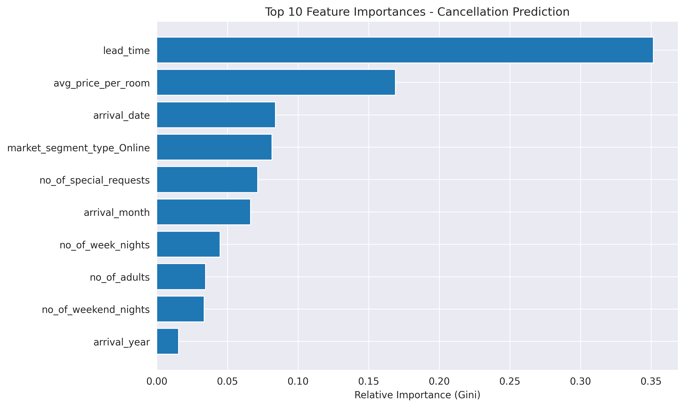
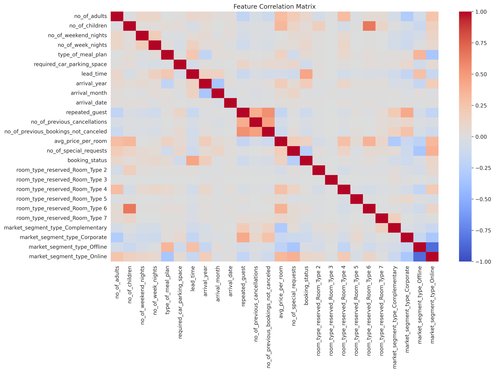

# Hotel Booking Cancellation Prediction (INN Hotels)

## Project Overview
This project builds machine learning models to predict hotel booking cancellations using historical booking data. The goal is to support revenue management and reduce financial losses due to last-minute cancellations.

## Business Problem
Hotel cancellations generate operational inefficiencies and revenue uncertainty. By predicting cancellation probability at booking time, hotels can:
- Improve overbooking strategies
- Optimize pricing policies
- Reduce revenue volatility

## Dataset
The dataset contains historical booking information including:
- Lead time
- Market segment
- Deposit type
- Special requests
- Booking channel
- Customer type
- Cancellation flag (target variable)

## Methodology
1. Data Cleaning
2. Exploratory Data Analysis (EDA)
3. Feature Engineering
4. Model Training:
   - Logistic Regression
   - Decision Tree
   - Random Forest
   - Gradient Boosting
5. Model Evaluation:
   - Accuracy
   - Precision / Recall
   - ROC-AUC

## Results

The best-performing model was **Logistic Regression**, achieving:

- **Accuracy:** 86.5%
- **ROC-AUC:** 0.860
- **Macro F1-score:** 0.85
- **Weighted F1-score:** 0.86

The model correctly identifies 90% of non-cancellations and 79% of cancellations, demonstrating strong discriminatory power and balanced performance across classes.

## Key Results (Visuals)

### ROC Curve – Model Comparison

Logistic Regression achieved the highest ROC-AUC (0.860), outperforming Decision Tree (0.847).

---

### Confusion Matrix – Best Model

---

### Top Feature Importances

---

### Feature Correlation Matrix

## Tech Stack
- Python
- pandas
- scikit-learn
- matplotlib
- seaborn

## Future Improvements
- Hyperparameter tuning
- Cross-validation pipeline
- Deployment via Flask or FastAPI
- Model interpretability using SHAP
